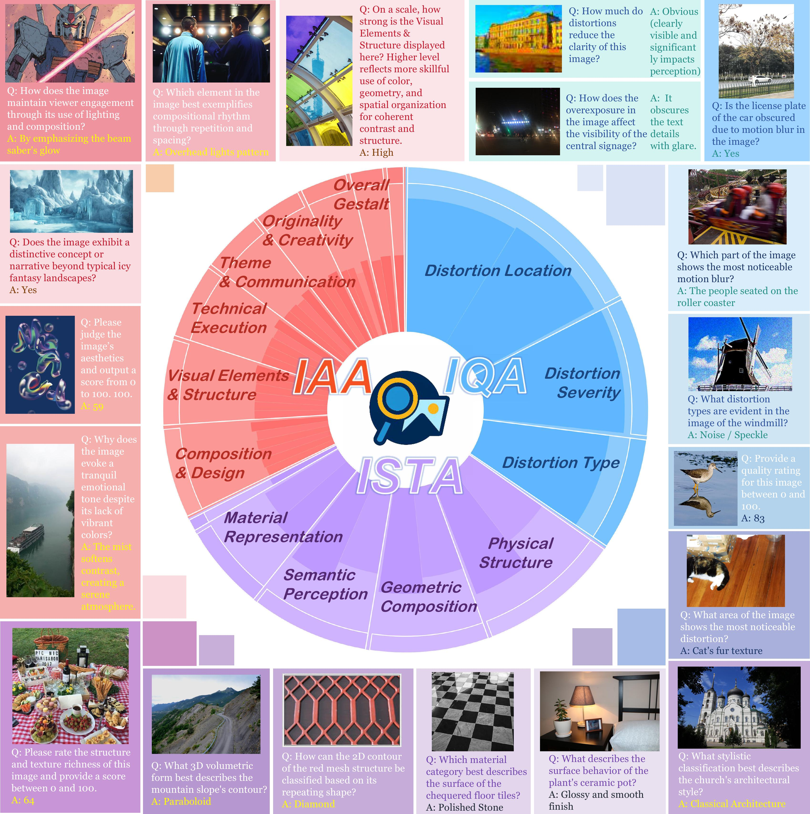
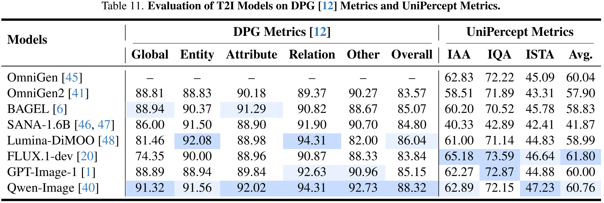

<div align="center">

# UniPercept: Towards Unified Perceptual-Level Image Understanding across Aesthetics, Quality, Structure, and Texture

<a href="https://arxiv.org/abs/2512.21675" target="_blank">
    
</a>
<a href="https://thunderbolt215.github.io/Unipercept-project/" target="_blank">
    
</a>
<a href="https://huggingface.co/Thunderbolt215215/UniPercept" target="_blank">
    
</a>
<a href="https://huggingface.co/datasets/Thunderbolt215215/UniPercept-Bench" target="_blank">
    
</a>
<a href="https://pypi.org/project/unipercept-reward/" target="_blank">
    
</a>

<div style="font-family: charter; text-align: center;">
<a href="#" target="_blank">Shuo Cao</a><sup>*</sup>,
<a href="#" target="_blank">Jiayang Li</a><sup>*</sup>,
<a href="#" target="_blank">Xiaohui Li</a>,
<a href="#" target="_blank">Yuandong Pu</a>,
<a href="#" target="_blank">Kaiwen Zhu</a>,
<a href="#" target="_blank">Yuanting Gao</a>,
<a href="#" target="_blank">Siqi Luo</a>,
<a href="#" target="_blank">Yi Xin</a>,
<a href="#" target="_blank">Qi Qin</a>,
<a href="#" target="_blank">Yu Zhou</a>,
<a href="#" target="_blank">Xiangyu Chen</a>,
<a href="#" target="_blank">Wenlong Zhang</a>,
<a href="#" target="_blank">Bin Fu</a>,
<a href="#" target="_blank">Yu Qiao</a>,
<a href="#" target="_blank">Yihao Liu</a><sup>&#8224;</sup>
<br>
<div style="font-size: 0.9em; margin-top: 0.5em;">
<span>University of Science and Technology of China</span> &emsp;
<span>Shanghai AI Laboratory</span> &emsp;
<span>Peking University</span>
</div>
<div style="font-size: 0.8em; margin-top: 0.5em; font-style: italic;">
<span>* Equal contribution</span> &emsp;
<span>&#8224; Corresponding author</span>
</div>
</div>

</div>

<p align="center">
    
</p>

⭐️ More Research:
- [ArtiMuse: Fine-Grained Image Aesthetics Assessment with Joint Scoring and Expert-Level Understanding](https://github.com/thunderbolt215/ArtiMuse)

## News & Updates

- [Jan 04, 2026] 📦 **Package Release**. We now support `unipercept-reward` as a standalone Python package! You can easily integrate perceptual scoring into your workflow via `pip install unipercept-reward`. Please refer to the **[Quick Start](#quick-start)** section for usage.

- [Dec 29, 2025] 🔥 **Official Release**
  - **[Technical Report](https://arxiv.org/abs/2512.21675)**
  - **[Project Page](https://thunderbolt215.github.io/Unipercept-project/)**
  - **[UniPercept-Bench](https://huggingface.co/datasets/Thunderbolt215215/UniPercept-Bench)**: A comprehensive perceptual-level understanding benchmark for MLLMs, spanning Image Aesthetics Assessment (IAA), Image Quality Assessment (IQA), and Image Structure & Texture Assessment (ISTA) across Visual Rating (VR) and Visual Question Answering (VQA) tasks.
  - **[UniPercept](https://huggingface.co/Thunderbolt215215/UniPercept)**: A powerful baseline MLLM specialized for perceptual image understanding, optimized via **Domain-Adaptive Pre-Training** and **Task-Aligned RL**.

<!-- ## 🚀 Quick Start -->
<h2 id="quick-start">🚀 Quick Start</h2>

### Installation

Install the package via pip:

```
pip install unipercept-reward
```

**Recommended:** To enable **Flash Attention** for faster inference and lower memory usage, install with the `flash` extra:

```
pip install "unipercept-reward[flash]"
```

### Basic Usage

Simple Inference Example

```python
from unipercept_reward import UniPerceptRewardInferencer

# 1. Initialize the inferencer
# This will automatically download weights from HF: Thunderbolt215215/UniPercept
inferencer = UniPerceptRewardInferencer(device="cuda")

# 2. Prepare image paths
image_paths = [
    "test.png"
]

# 3. Get reward scores
# Returns a list of dictionaries containing scores for multiple dimensions
rewards = inferencer.reward(image_paths=image_paths)

# 4. Print results
for path, score in zip(image_paths, rewards):
    if score:
        print(f"Image: {path}")
        print(f"  ➤ Aesthetics (IAA): {score['iaa']:.4f}")
        print(f"  ➤ Quality (IQA):    {score['iqa']:.4f}")
        print(f"  ➤ Structure (ISTA): {score['ista']:.4f}")

```

You can also load a model from a **local checkpoint** path:

```python
inferencer = UniPerceptRewardInferencer(
    model_path="/path/to/local/checkpoint",
    device="cuda"
)
```

### Output Metrics

The `.reward()` method returns a dictionary with three perceptual metrics for each image. All scores are on a scale of 0 to 100, where higher scores indicate better performance/quality.

| Key | Metric Name | Description |
| --- | --- | --- |
| **`iaa`** | Image Aesthetics Assessment | Evaluates the aesthetic quality of the image. |
| **`iqa`** | Image Quality Assessment | Evaluates the quality. |
| **`ista`** | Image Structure & Texture Assessment | Evaluates the richness of structure and texture details. |

## 🌟 Abstract

Multimodal large language models (MLLMs) have achieved remarkable progress in visual understanding tasks such as visual grounding, segmentation, and captioning. However, their ability to perceive **perceptual-level** image features remains limited. In this work, we present **UniPercept-Bench**, a unified framework for *perceptual-level image understanding* across three key domains: **Aesthetics**, **Quality**, and **Structure and Texture**. We establish a hierarchical definition system and construct large-scale datasets to evaluate perceptual-level image understanding. Based on this foundation, we develop a strong baseline **UniPercept** trained via Domain-Adaptive Pre-Training and Task-Aligned RL, enabling robust generalization across both **Visual Rating (VR)** and **Visual Question Answering (VQA)** tasks. UniPercept outperforms existing MLLMs on perceptual-level image understanding and can serve as a **plug-and-play reward model** for text-to-image generation. This work defines Perceptual-Level Image Understanding in the era of MLLMs and, through the introduction of a comprehensive benchmark together with a strong baseline, provides a solid foundation for advancing perceptual-level multimodal image understanding.


<!-- <p align="center">
    
</p> -->

## 📊 UniPercept-Bench
We introduce **UniPercept-Bench**, a systematic benchmark for perceptual image understanding:
* **Comprehensive Coverage**: Spans **3 domains** (IAA, IQA, ISTA), **17 categories**, and **43 criteria**.
* **Perceptual Tasks**: Supports both **Visual Rating (VR)** and **Visual Question Answering (VQA)**.
<!-- We introduce **UniPercept-Bench**, a systematically designed benchmark for evaluating perceptual-level image understanding.

* **Hierarchical Taxonomy**: Organized into **Domain $\rightarrow$ Category $\rightarrow$ Criterion** layers.
* **Coverage**: 3 Domains (IAA, IQA, ISTA), 17 Categories, and 43 Criterions.
* **Tasks**:
    * **Visual Rating (VR)**: Quantitative scoring of perceptual attributes.
    * **Visual Question Answering (VQA)**: Fine-grained reasoning about visual properties. -->

**Download**: 🤗 [UniPercept-Bench](https://huggingface.co/datasets/Thunderbolt215215/UniPercept-Bench)
<p align="center">
    
</p>

## 🔍 UniPercept

**UniPercept** is a strong baseline MLLM trained via Domain-Adaptive Pre-Training and Task-Aligned RL to handle both **Visual Rating (VR)** (continuous scoring) and **Visual Question Answering (VQA)** (reasoning).

### 🛠️ Setup

```
conda create -n unipercept python=3.10
conda activate unipercept
cd UniPercept
pip install -r requirements.txt
```

### 📉 Evaluation

Please download the UniPercept weights from [🤗 UniPercept](https://huggingface.co/Thunderbolt215215/UniPercept) and place them in the `ckpt/` directory.

**Visual Rating (VR)**

Please download the datasets listed below and place them in the corresponding paths.

| Dataset | Domain | Download | Path |
| :--- | :---: | :---: | :--- |
| **ArtiMuse-10K** | IAA | 🤗 [Link](https://huggingface.co/datasets/Thunderbolt215215/ArtiMuse-10K) | `benchmark/VR/IAA/ArtiMuse-10K/image` |
| **AVA** | IAA | [Link](https://github.com/imfing/ava_downloader) | `benchmark/VR/IAA/AVA/image` |
| **TAD66K** | IAA | [Link](https://github.com/woshidandan/TANet-image-aesthetics-and-quality-assessment) | `benchmark/VR/IAA/TAD66K/image` |
| **FLICKR-AES** | IAA | [Link](https://github.com/alanspike/personalizedImageAesthetics) | `benchmark/VR/IAA/FLICKR-AES/image` |
| **KonIQ-10K** | IQA | [Link](https://database.mmsp-kn.de/koniq-10k-database.html) | `benchmark/VR/IQA/KonIQ-10K/image` |
| **SPAQ** | IQA | [Link](https://github.com/h4nwei/SPAQ) | `benchmark/VR/IQA/SPAQ/image` |
| **KADID** | IQA | [Link](https://database.mmsp-kn.de/kadid-10k-database.html) | `benchmark/VR/IQA/KADID/image` |
| **PIPAL** | IQA | [Link](https://github.com/HaomingCai/PIPAL-dataset) | `benchmark/VR/IQA/PIPAL/image` |、
| **ISTA-10K** | ISTA | 🤗 [Link](https://huggingface.co/datasets/Thunderbolt215215/UniPercept-Bench) | `benchmark/VR/ISTA/ISTA-10K/image` |

After setting up the data, you can configure the target datasets and devices in `src/eval/eval_vr.sh`. The results will be saved to `results/vr`.

```
cd UniPercept
bash src/eval/eval_vr.sh 
```

**Visual Question Answering (VQA)**

Please download **UniPercept-Bench-VQA** from [🤗 UniPercept-Bench](https://huggingface.co/datasets/Thunderbolt215215/UniPercept-Bench) and place them into `benchmark/VQA`.
Then you can configure the target domain in `src/eval/eval_vqa.sh`. The evaluation results will be saved to `results/vqa`.

```
cd UniPercept
bash src/eval/eval_vqa.sh 
```

**Interactive Image Perception**

You can engage in comprehensive conversations with UniPercept regarding various aspects of an image, such as its aesthetics, quality, and structural details. An example is provided below, which you can customize based on your needs, or refer to [InternVL](https://github.com/OpenGVLab/InternVL) for further implementation details.

```
cd UniPercept
bash src/eval/conversation.sh
```


### 🏆 Performance

UniPercept consistently outperforms proprietary models (e.g., GPT-4o, Gemini-2.5-Pro), leading open-source models (InternVL3, Qwen3-VL) and across all three perceptual domains (IAA, IQA, ISTA) and tasks (VR, VQA).

<!-- <p align="center">
    
    
    
    
</p> -->

<details open>
  <summary>Performance on UniPercept-Bench-VR</summary>
  
</details>

<details>
  <summary>Performance on UniPercept-Bench-VQA (IAA)</summary>
  
</details>

<details>
  <summary>Performance on UniPercept-Bench-VQA (IQA)</summary>
  
</details>

<details>
  <summary>Performance on UniPercept-Bench-VQA (ISTA)</summary>
  
</details>

### 🎨 Applications

**UniPercept As Reward** 

UniPercept can be used as a powerful reward model for post-training Text-to-Image (T2I) models. By integrating UniPercept rewards into the training of **FLUX.1-dev**, we observe significant improvements in aesthetic quality, structural richness, and prompt adherence.

<p align="center">
    
</p>

**UniPercept As Metrics**

UniPercept can serve as an perceptual-level metric that assesses the quality of outputs from any model producing images, covering three complementary dimensions: IAA, IQA, and ISTA.

<p align="center">
    
    
</p>

### 🖼️ UniPercept-Constructed Image Profiles
UniPercept performs comprehensive perceptual-level image analysis, delivering accurate visual ratings across the IAA, IQA, and ISTA dimensions, along with fine-grained multi-dimensional analytical outputs that together form a detailed image profile.


<p align="center">
    
    
    
</p>

## ✏️ Citation

If you find UniPercept useful for your research, please consider citing our work:

```
@misc{cao2025uniperceptunifiedperceptuallevelimage,
      title={UniPercept: Towards Unified Perceptual-Level Image Understanding across Aesthetics, Quality, Structure, and Texture}, 
      author={Shuo Cao and Jiayang Li and Xiaohui Li and Yuandong Pu and Kaiwen Zhu and Yuanting Gao and Siqi Luo and Yi Xin and Qi Qin and Yu Zhou and Xiangyu Chen and Wenlong Zhang and Bin Fu and Yu Qiao and Yihao Liu},
      year={2025},
      eprint={2512.21675},
      archivePrefix={arXiv},
      primaryClass={cs.CV},
      url={https://arxiv.org/abs/2512.21675}, 
}

@misc{cao2025artimusefinegrainedimageaesthetics,
      title={ArtiMuse: Fine-Grained Image Aesthetics Assessment with Joint Scoring and Expert-Level Understanding}, 
      author={Shuo Cao and Nan Ma and Jiayang Li and Xiaohui Li and Lihao Shao and Kaiwen Zhu and Yu Zhou and Yuandong Pu and Jiarui Wu and Jiaquan Wang and Bo Qu and Wenhai Wang and Yu Qiao and Dajuin Yao and Yihao Liu},
      year={2025},
      eprint={2507.14533},
      archivePrefix={arXiv},
      primaryClass={cs.CV},
      url={https://arxiv.org/abs/2507.14533}, 
}
```
